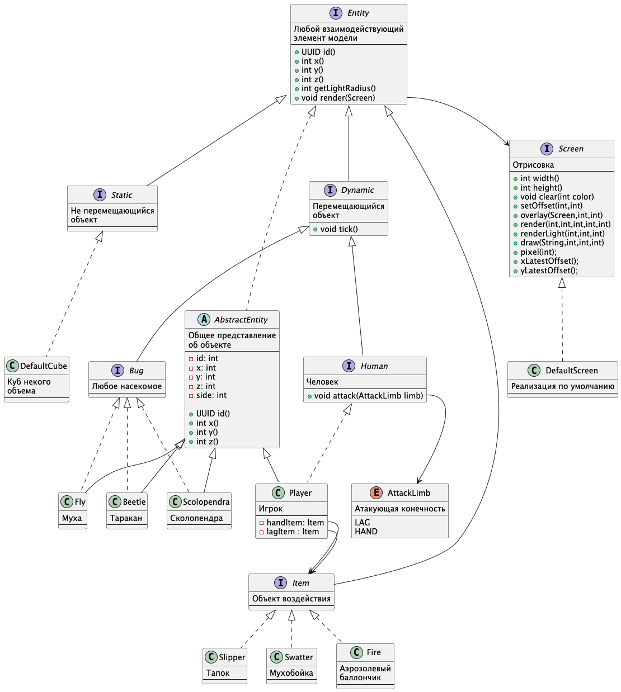

# Общага

Итоговый модуль курса: маленькая игра, в которой собрано всё, что разбиралось в
`vol0`–`vol8` — интерфейсы и наследование, фабрики, композиция, неизменяемые объекты,
работа с ресурсами и игровой цикл.

## Как запустить

```bash
mvn -B -pl dormitory clean package && java -cp dormitory/target/classes ru.mifi.practice.Main
```

Управление: `WASD`, стрелки или цифровой блок — ходьба; `Пробел`, `Ctrl`, `C` — удар;
`Enter`, `Tab`, `X` — применить предмет; цифры `1`–`3` — выбор предмета
(свеча, тапок, мухобойка). Окно должно быть в фокусе, иначе ввод не читается.

## Модель

### Что входит в модель

1. Комната
2. Недвижимые объекты: стол, стулья, шкафы
3. Движимые объекты: человек (игрок), насекомые (мухи, тараканы, сколопендра)
4. Объекты действия: свеча, тапок, мухобойка, аэрозольный баллончик + зажигалка

### Поведение модели

#### Исходные данные

1. В комнате расставлена мебель (недвижимые объекты)
2. В комнате присутствует некоторое количество движимых объектов (насекомых)
3. В комнате присутствует игрок
4. У игрока из инвентаря присутствует тапок и свеча

#### Поведение

1. Комната тёмная
2. Игрок ходит со свечой и освещает окружность вокруг себя
3. Тараканы и сколопендры бегают по полу и разбегаются от света
4. Мухи кружат на высоте вокруг источника света
5. Насекомые с определённой вероятностью размножаются
6. Игрок ходит по комнате и давит тапком тараканов и сколопендр, а также убивает мух
   мухобойкой (за раз одно насекомое)

## Диаграмма классов



## Отрисовка и графика

[DESIGN.md](DESIGN.md) — проект новой подсистемы отрисовки и бриф для художника:
тайлы 32×32 в полном цвете, формат карты уровня, освещение и постобработка
в духе Lone Survivor, состав этажа общаги, список ассетов и план работ по коду.

Текущая отрисовка — старая: спрайты 8×8, четыре градации, перекраска палитрой,
процедурный генератор комнаты. Она будет заменена по этому проекту.

## Как устроен код

Три пакета, каждый со своей ответственностью:

| Пакет | Отвечает за | Ключевые типы |
|---|---|---|
| `ui` | окно, кадры, ввод | [Model](src/main/java/ru/mifi/practice/ui/Model.java), [Screen](src/main/java/ru/mifi/practice/ui/Screen.java), [Handler](src/main/java/ru/mifi/practice/ui/Handler.java), [Tile](src/main/java/ru/mifi/practice/ui/Tile.java) |
| `room` | карта и населяющие её сущности | [Room](src/main/java/ru/mifi/practice/room/Room.java), `room.Default` |
| `entity` | всё, что живёт в комнате | [Entity](src/main/java/ru/mifi/practice/entity/Entity.java), `Dynamic`, `Static`, `Bug`, `Human`, `Item` |

Устройство, которое стоит заметить:

- **Экран хранит индексы, а не цвета.** Пиксель — байт, номер в
  [Palette](src/main/java/ru/mifi/practice/ui/Palette.java). Один и тот же спрайт из
  `icons.png` красится в любые четыре оттенка через [Color](src/main/java/ru/mifi/practice/ui/Color.java).
- **Свет — это второй экран.** `renderLight` рисует пятна света на отдельном экране,
  затем `overlay` гасит по нему основной кадр с дизерингом.
- **Комната не знает классов сущностей.** Всё создаётся через
  [EntityFactory](src/main/java/ru/mifi/practice/entity/EntityFactory.java), а реализации
  пакетно-приватные.
- **Сущности разложены по клеткам** (`entitiesInTiles`), поэтому поиск соседей при
  столкновении не перебирает всех.
- **Тик и кадр развязаны:** тиков ровно 60 в секунду, кадры рисуются по остатку времени.

## Анализ: что из описания уже работает

| Из описания | Состояние | Где |
|---|---|---|
| Комната | ✅ 24×24 клетки: стены по периметру, дощатый пол внутри | [Room.DEFAULT_GENERATOR](src/main/java/ru/mifi/practice/room/Room.java) |
| Мебель: стол, стулья, шкафы | ✅ стол, два стула и два шкафа расставлены генератором, рисуются и не пускают сквозь себя | [Furniture](src/main/java/ru/mifi/practice/entity/Furniture.java) |
| Игрок | ✅ ходит, бьёт, тратит и восстанавливает выносливость | [Player](src/main/java/ru/mifi/practice/entity/Player.java) |
| Мухи | ✅ кружат вокруг источника света по инерции с трением | [Fly](src/main/java/ru/mifi/practice/entity/Fly.java) |
| Тараканы, сколопендры | ❌ `Bug` — пустой интерфейс-маркер, реализация одна: муха | [Bug](src/main/java/ru/mifi/practice/entity/Bug.java) |
| Свеча, тапок, мухобойка | ✅ реализованы, переключаются цифрами; баллончика с зажигалкой нет | [Candle](src/main/java/ru/mifi/practice/entity/Candle.java), [Slipper](src/main/java/ru/mifi/practice/entity/Slipper.java), [Swatter](src/main/java/ru/mifi/practice/entity/Swatter.java) |
| Комната тёмная | ✅ свет считается и накладывается на кадр | `Model.render`, `Room.renderLight` |
| Свет идёт от свечи | ✅ радиус берётся с предмета: со свечой 9, без неё 2 | `Player.getLightRadius` |
| Насекомые разбегаются от света | ❌ мухи, наоборот, к свету летят; убегающих нет | — |
| Насекомые размножаются | ❌ количество задано в конструкторе комнаты и не меняется | `room.Default` |
| Удар предметом | ✅ тапок бьёт бегающих, мухобойка — летающих, бонус начисляется | `Player.attack`, `Item.reaches` |

Итого: каркас собран и работает — цикл, свет, столкновения, поведение мух, предметы,
инвентарь, комната с мебелью. Не хватает **содержания**: второго и третьего вида
насекомых, размножения и правил партии.

### Что мешает доделывать прямо сейчас

1. **Игрока нельзя ранить.** `Player` не переопределяет `hurt`, поэтому `hurtTime`,
   `xKnockBack` и `yKnockBack` никогда не выставляются, а `health` не меняется. Пока
   насекомые безобидны, партия не может закончиться.
2. **Смерть сущности обработана наполовину.** `room.tick` убирает сущность из карты по
   `isRemoved()`, но `player()` продолжает возвращать ту же ссылку — умерший игрок
   останется на экране.
3. **Тестами покрыты предметы, инвентарь, генератор и мебель** — 19 тестов
   в `src/test`. Всё, что связано с окном и отрисовкой, по-прежнему проверяется глазами.
4. **Индексы спрайтов — магические числа** вида `7 + 13 * 32`, разбросанные по коду.
   Второй лист `icons2.png` не используется.

## План: что нужно сделать, чтобы игру доделать

Порядок выбран так, чтобы каждый этап заканчивался чем-то, что видно на экране,
и опирался только на предыдущие.

### Этап 1. Предметы и инвентарь — ✅ сделано

Без этого не делалось ничего из описания: и свеча, и тапок, и мухобойка — это `Item`.

1. ✅ [Inventory](src/main/java/ru/mifi/practice/entity/Inventory.java) — неизменяемый
   список предметов и один выбранный; переключение цифрами `1`–`9` через `Handler.slot()`.
2. ✅ [Candle](src/main/java/ru/mifi/practice/entity/Candle.java) — радиус света 9.
   Константа из `Player.getLightRadius` убрана: радиус приходит с предмета, без него
   остаётся 2, и темнота действительно чувствуется.
3. ✅ [Slipper](src/main/java/ru/mifi/practice/entity/Slipper.java) — +4 по бегающим,
   ноль по летающим.
4. ✅ [Swatter](src/main/java/ru/mifi/practice/entity/Swatter.java) — +20 по летающим,
   ноль по бегающим.
5. ✅ Иконки предметов и строка инвентаря справа внизу, выбранный подсвечен.

Попутно промах переехал из жертвы в орудие. Раньше `Fly.hurt` глотал 90 % ударов
случайным броском — муху нельзя было убить ничем, и причина была не видна.
Теперь за это отвечает `Item.reaches`: тапок до мухи в воздухе не достаёт, мухобойка
достаёт, и правило читается там, где ему место.

**Готово, когда:** игрок выбирает свечу — круг света растёт; выбирает тапок — мухи
перестают умирать; выбирает мухобойку — умирают. Проверено 12 тестами в
[src/test](src/test/java/ru/mifi/practice/entity).

### Этап 2. Комната вместо поля — ✅ сделано

1. ✅ Генератор кладёт стены по периметру и пол внутри. Лугового набора клеток больше
   нет: трава, вода и цветы остались бы мёртвым кодом, поэтому вместо пяти видов
   клеток стало два — `WALL` и `FLOOR`. Заодно исчезли флаги `connectsToGrass`,
   `connectsToSand` и `connectsToWater`, которыми пользовались только они.
2. ✅ `Cube` стал [Furniture](src/main/java/ru/mifi/practice/entity/Furniture.java):
   рисуется, не пускает сквозь себя, размеры задаются конструктором — стол 24×16,
   стул 12×12, шкаф 16×24.
3. ✅ Мебель расставляет генератор — параметр `EntityFactory`, до сих пор ни разу
   не использованный, наконец пригодился. Для этого `Data` получил список сущностей.
   Насекомых там нет: их конструктор требует уже созданную комнату.
4. ✅ Ветка с `Entity.blocks` в `move2` заработала. Мешало то, что
   `AbstractStaticEntity` не переопределял `intersects` — комната отбирает соседей
   именно им, и неподвижные сущности в выборку не попадали вовсе. Пока мебели
   не было, дефект ничем себя не проявлял.

Попутно: мухи отскакивают от стен. Летают они по координатам, минуя проверку клеток,
поэтому границы комнаты пришлось учесть в самой мухе.

**Готово, когда:** игрок ходит по комнате, а не по бесконечному лугу, и обходит стол.
Проверено 7 тестами на генератор и мебель.

### Этап 3. Тараканы и сколопендры

1. `Cockroach implements Bug` — бегает по полу, от света **убегает**: направление
   считается как у мухи, но вектор на источник берётся с обратным знаком, и движение
   идёт через `move(room, xa, ya)`, чтобы работали столкновения со стенами и мебелью.
2. `Centipede implements Bug` — медленнее, живучее, движется отрезками.
3. Наделить `Bug` тем, что отличает виды: `boolean flying()` (или отдельный подтип),
   чтобы предметы из этапа 1 могли решать, чем по кому бить.
4. Добавить их создание в `EntityFactory` и расстановку в генератор.

**Готово, когда:** при подходе со свечой тараканы разбегаются, а мухи слетаются.

### Этап 4. Размножение

1. Добавить `Bug` счётчик и вероятность деления: раз в N тактов с вероятностью `p`
   насекомое просит комнату создать ещё одно рядом.
2. Комнате нужен метод добавления сущности во время тика — сейчас `room.tick`
   обходит копию `entities`, так что добавление безопасно, но это стоит закрепить
   тестом, а не полагаться на случай.
3. Ограничить популяцию сверху, иначе через минуту в комнате будут тысячи насекомых
   и кадры просядут.

**Готово, когда:** если ничего не делать, насекомых становится больше.

### Этап 5. Правила партии

1. Переопределить `Player.hurt`: урон, откидывание (`xKnockBack`/`yKnockBack`),
   неуязвимость на `hurtTime` тактов.
2. Заставить насекомых кусаться при касании — `touchedBy` уже вызывается из `move2`.
3. Ввести конец партии: игрок умер — поражение; насекомых не осталось — победа.
   Экран с результатом рисовать через уже существующий `renderSplashMessage`.
4. Починить `room.player()` для случая смерти: возвращать `Optional<Human>` либо
   явно переводить комнату в состояние «партия окончена».

**Готово, когда:** в игре можно выиграть и проиграть.

### Этап 6. Порядок в коде

Делать по ходу предыдущих этапов, не отдельным заходом:

1. **Тесты.** Предметы и инвентарь уже покрыты. Дальше — то, что тоже не требует
   окна: `Color.get` (упаковка четырёх оттенков), `Palette` (границы индексов),
   генератор карты (все клетки заполнены), `move2` (упирается в стену, скользит вдоль),
   поведение `Bug` (уходит от света). По `RULE.md`: одно утверждение на тест,
   без общих `setUp`, имя читается предложением.
2. **Магические числа спрайтов.** Индексы вида `7 + 13 * 32` собрать в один тип
   `Sprite` с осмысленными именами — сейчас, чтобы понять, что рисуется, нужно
   открывать `icons.png` и считать клетки.
3. **`Model.Default` всё ещё великоват** — 15 полей и три роли: окно, игровой цикл,
   отрисовка. Разделить на `Window`, `Loop` и `Renderer`, оставив `Model` фасадом.
4. **`Player` — 14 полей.** Выделить `Stamina` (запас, восстановление, задержка) и
   `Attack` (направление, время, предмет) отдельными объектами.
5. **`Entity` — 11 методов**, большинство со значениями по умолчанию. После появления
   предметов и насекомых станет видно, какие из них действительно общие, а какие
   принадлежат `Dynamic` или `Item`, — интерфейс стоит пересобрать по факту.
6. **`icons2.png`** либо задействовать, либо удалить.

### Чего в плане намеренно нет

- Звук, сохранение партии, несколько комнат, меню — всё это за рамками описания модели.
- Сеть и многопользовательский режим — тем более.
