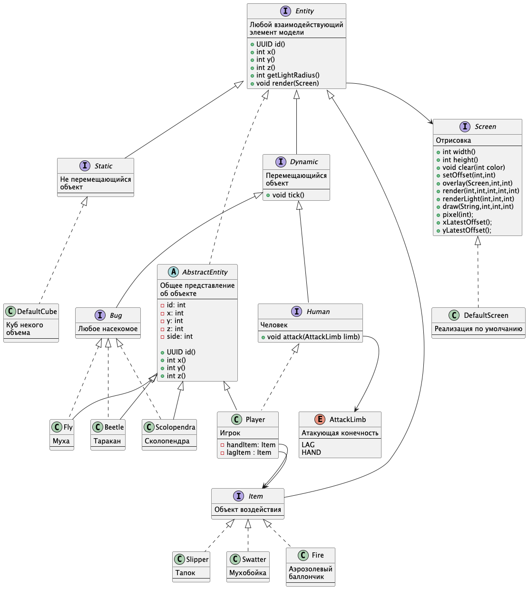

== Модель

=== Что входит в модель

1. Комната
2. Не движимые объекты: стол, стулья, шкафы
3. Движимые объекты: человек (игрок), насекомые(мухи, тараканы, сколопендра)
4. Объекты действия: свеча, тапок, мухобойка,
аэрозолевый баллончик + зажигалка

=== Поведение модели

==== Исходные данные

1. В комнате расставлена мебель (не движимые объекты)
2. В комнате присутствует некоторое количество движимых
объектов (насекомых)
3. В комнате присутствует игрок.
4. У игрока из инвентаря присутствует тапок и свеча.

==== Поведение

1. Комната темная
2. Игрок ходит со свечой и освещает себя окружность вокруг себя
3. Тараканы и сколопендры бегают по полю и разбегаются от света
4. Мухи кружат на высоте вокруг источника света
5. Насекомые с определенной вероятностью размножаются
6. Пользователь ходит по комнате и давит тапком тараканов и сколопендр,
а также убивает мух мухобойкой (за раз одно насекомое)

== Диаграмма классов

